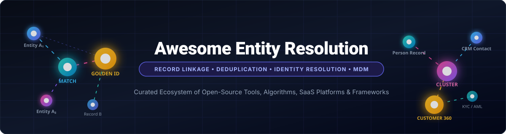

# 🌐 Awesome Entity Resolution [](https://github.com/ishandutta2007/Awesome-Awesome-Awesome)

<p align="center">
  
</p>

<p align="center">
  <a href="https://github.com/ishandutta2007/Awesome-Awesome-Awesome"></a>
  <a href="https://discord.gg/jc4xtF58Ve"></a>
  <a href="https://github.com/ishandutta2007/Awesome-Entity-Resolution/stargazers"></a>
  <a href="https://github.com/ishandutta2007/Awesome-Entity-Resolution/network/members"></a>
  <a href="https://github.com/ishandutta2007/Awesome-Entity-Resolution/blob/main/LICENSE"></a>
  <a href="https://github.com/ishandutta2007/Awesome-Entity-Resolution/pulls"></a>
  <a href="https://github.com/ishandutta2007"></a>
</p>

---

### 🚀 Top Entity Resolution, Record Linkage & Master Data Management Tools Ecosystem

> **A comprehensive, SEO-optimized, curated guide to SaaS/Hosted Platforms & Open-Source GitHub Projects**  
> *Specialized in Entity Resolution, Record Linkage, Identity Resolution, Data Deduplication, Fuzzy Matching & Master Data Management (MDM)*  
> **Last updated: August 2026**

This repository tracks top **SaaS/hosted platforms** and **open-source frameworks** for **Entity Resolution (ER)**. These technologies determine when heterogeneous records across disparate databases, data lakes, CRM/ERP applications, or unstructured documents represent the same real-world entity — such as customers, businesses, vendors, addresses, products, patient identities, or financial transactions.

Entity resolution is also widely known across data engineering and computer science as:
- **Record Linkage & Data Matching**
- **Identity Resolution & Customer 360**
- **Data Deduplication & Fuzzy Matching**
- **Master Data Management (MDM) & Golden Record Creation**
- **Entity Disambiguation & Knowledge Graph Alignment**

---

## 📑 Table of Contents

- [📊 SaaS / Hosted Platforms](#-saas--hosted-platforms)
- [💻 Open-Source GitHub Projects](#-open-source-github-projects)
- [🔍 Category-Wise Open-Source Projects](#-category-wise-open-source-projects)
  - [🔗 Record Linkage & Probabilistic Matching](#-record-linkage--probabilistic-matching)
  - [🧹 Data Cleaning & Pre-Linkage Validation](#-data-cleaning--pre-linkage-validation)
  - [⚡ Search, Blocking & Candidate Generation](#-search-blocking--candidate-generation)
  - [🧠 NLP, Semantic Embeddings & Neural Matching](#-nlp-semantic-embeddings--neural-matching)
  - [🕸️ Graph Databases & Relationship Resolution](#-graph-databases--relationship-resolution)
- [🏗️ Building a Custom Open-Source Entity Resolution Stack](#-building-a-custom-open-source-entity-resolution-stack)
- [⭐ Star History](#-star-history)
- [🤝 How to Contribute](#-how-to-contribute)
- [📜 Disclaimer](#-disclaimer)

---

## 📊 SaaS / Hosted Platforms

*Sorted by **Company Size (Valuation / Market Capitalization / Annual Revenue)** in descending order.*

| Platform / Product | Description | Company Size (Valuation / Revenue) | Starting Tier Pricing | Free Tier / Trial Limits |
| :--- | :--- | :--- | :--- | :--- |
| **[Microsoft Dynamics 365 Customer Insights](https://www.microsoft.com/dynamics-365/products/customer-insights)** | Enterprise Customer Data Platform (CDP) with automated AI identity resolution, cross-channel matching, and profile enrichment across enterprise systems. | ~$3.2 Trillion (Market Cap) / $245B+ Annual Revenue | $1,700/tenant/month (or $1,000/tenant/month attach license for existing Dynamics 365 users) | 30-day free trial with full access to Customer Insights Data & Journeys (no credit card required) |
| **[Oracle Customer Data Management](https://www.oracle.com/cx/customer-data-management/)** | Cloud customer data master platform providing duplicate identification, merge rules, survivorship, and address validation for single customer view. | ~$370 Billion (Market Cap) / $53B Annual Revenue | $300 per 1,000 records/month (or $100 per user/month) | 30-day free trial with $300 in Oracle Cloud credits plus access to Oracle Cloud Always Free services |
| **[Salesforce Data Cloud](https://www.salesforce.com/data/)** | Hyperscale customer data engine with real-time identity resolution rules, fuzzy matching algorithms, and unified customer graph generation. | ~$280 Billion (Market Cap) / $35B Annual Revenue | $60,000/year for Starter Edition (or add-on credit packs from $500 for 100,000 credits) | Free Provisioning SKU for Enterprise/Unlimited Edition customers (includes 250,000 Data Cloud credits and 1 TB storage) |
| **[SAP Master Data Governance](https://www.sap.com/products/technology-platform/master-data-governance.html)** | Enterprise MDM platform supporting centralized master data consolidation, duplicate detection, automated match-and-merge, and governance. | ~$260 Billion (Market Cap) / €32B Annual Revenue | ~$6,250/month (~$75,000/year for Cloud Edition up to 5,000 master data objects) | 30-day free trial via SAP Business Technology Platform (BTP) / 90-day guided evaluation |
| **[IBM InfoSphere Master Data Management](https://www.ibm.com/products/ibm-infosphere-master-data-management)** | Proven enterprise MDM and entity-matching platform providing deterministic/probabilistic linkage, survivorship, and 360-degree governance views. | ~$210 Billion (Market Cap) / $62B Annual Revenue | ~$3,500/month (~$42,000/year on IBM Cloud / software license) | 30-day free trial on IBM Cloud with $200 free trial credits across cloud services |
| **[Neustar (TransUnion)](https://www.transunion.com/solution/neustar)** | Identity resolution and entity intelligence powered by TransUnion's identity graph (OneID), supporting KYC, fraud prevention, and marketing attribution. | ~$20 Billion (TransUnion Market Cap) / Acquired for $3.1B | ~$1,000–$2,000/month (~$12,000/year for OneID API packages) | 30-day test environment / evaluation sandbox upon developer inquiry |
| **[Informatica MDM](https://www.informatica.com/products/master-data-management.html)** | Intelligent Multidomain MDM powered by CLAIRE AI for automatic identity matching, hierarchy management, and golden record orchestration. | ~$8.5 Billion (Market Cap) / $1.6B Annual Revenue | ~$1,250/month ($15,000/year for base IDMC IPU consumption packs); Core licenses from $70,000/year | 30-day free trial on Informatica IDMC with 500 compute hours and up to 10,000 processed rows |
| **[Dun & Bradstreet](https://www.dnb.com/)** | Global business entity resolution using D-U-N-S Number matching, corporate hierarchy resolution, and B2B master data enrichment. | ~$4.5 Billion (Market Cap) / $2.3B Annual Revenue | ~$2,500/year (~$208/month) for D&B Hoovers / D&B Direct+ entry API package | 30-day free trial with 1,000 free test API calls via D&B Direct+ Developer Portal |
| **[Relativity](https://www.relativity.com/)** | Legal, investigative, and compliance platform with entity extraction, name normalization, and relationship resolution over massive unstructured datasets. | ~$3.6 Billion (Valuation) / $400M+ Annual Revenue | RelativityOne starts at ~$30–$40/GB per month with ~$5,000/month platform minimum | 14 to 30-day guided evaluation sandbox upon enterprise inquiry (no self-service free tier) |
| **[Precisely](https://www.precisely.com/)** | Data integrity suite offering enterprise data deduplication, address verification, location intelligence, and master entity resolution. | ~$3.5 Billion (Valuation) / $1B Annual Revenue | ~$20,000–$35,000/year for Data Integrity Suite / Spectrum modules | 30-day free trial / interactive developer sandbox for Data Integrity Suite APIs |
| **[Acxiom](https://www.acxiom.com/)** | Customer intelligence and identity-data platform featuring Real Identity for cross-channel customer matching, hygiene, and household clustering. | ~$2.3 Billion (Acquisition by IPG) / $450M+ Annual Revenue | ~$1,500/month (~$18,000/year for Real Identity / identity hygiene APIs) | 30-day evaluation sandbox / sample batch match of up to 5,000 records upon sales consultation |
| **[LiveRamp](https://liveramp.com/)** | Omnichannel identity collaboration platform built around RampID for privacy-first identity resolution, entity graph matching, and partner linkage. | ~$2.0 Billion (Market Cap) / $660M Annual Revenue | ~$2,500/month (~$30,000/year for RampID / Identity Resolution base tier) | 14-day trial / developer sandbox with up to 10,000 test identity graph records |
| **[Quantexa](https://www.quantexa.com/)** | Contextual Decision Intelligence platform combining real-time dynamic entity resolution with massive scale knowledge graph network analytics. | ~$1.8 Billion (Valuation - Series E Unicorn) / $100M+ ARR | ~$100,000/year (scaled by entity volume and network complexity) | 30-day custom Proof of Value (PoV) / guided sandbox trial upon enterprise engagement (no self-service free tier) |
| **[Reltio](https://www.reltio.com/)** | Cloud-native modern master data platform featuring AI entity resolution, real-time match-and-merge, graph relationships, and automated survivorship. | ~$1.7 Billion (Valuation - Series E Unicorn) / $120M+ ARR | ~$60,000/year (~$5,000/month for Connected Data Platform / Multidomain MDM) | 30-day guided trial / sandbox on AWS/Azure Marketplace upon request (no self-service free tier) |
| **[Riversand / Syndigo](https://syndigo.com/)** | Cloud-native multidomain MDM and PIM solution providing product/supplier/customer data consolidation, enrichment, and entity governance. | ~$1.5 Billion (Parent Syndigo Valuation) / $150M+ Revenue | ~$25,000–$40,000/year for Multidomain MDM base tier | 14 to 30-day guided interactive demo / sandbox upon request (no self-service free tier) |
| **[Ataccama ONE](https://www.ataccama.com/)** | Unified data management platform integrating data profiling, automated data quality, master record reconciliation, and reference data management. | ~$550 Million (Valuation - Bain Capital) / $100M+ ARR | ~$30,000/year (~$2,500/month based on named users and managed data objects) | 30-day free trial of Ataccama ONE Cloud platform with sample datasets and data quality checks |
| **[Stibo Systems STEP](https://www.stibosystems.com/)** | Enterprise Multidomain MDM platform specializing in product, customer, supplier, and location master data modeling, matching, and syndication. | ~$400 Million (Valuation) / $120M+ Annual Revenue | ~$50,000–$75,000/year for Enterprise SaaS tier | 30-day structured Proof of Concept (PoC) / sandbox on request (no self-service free tier) |
| **[Tamr](https://www.tamr.com/)** | AI-native data mastering and entity resolution platform using active machine learning to deduplicate, cluster, and enrich enterprise records. | ~$300 Million (Valuation) / $40M+ ARR | ~$50,000/year (~$4,166/month, output-based golden record tiers) | 14 to 30-day guided Proof of Concept (PoC) / sandbox evaluation upon sales request (no self-service free tier) |
| **[DataWalk](https://datawalk.com/)** | Graph-driven investigative analysis platform linking people, vehicles, phones, transactions, and organizations for fraud detection and intelligence. | ~$180 Million (Market Cap: WSE:DAT) / $15M+ ARR | ~$3,000/month (~$36,000/year) or $50,000 base package deployment | 30-day Proof of Concept (PoC) evaluation environment upon request (no self-service free tier) |
| **[Profisee](https://profisee.com/)** | Fast-to-deploy Master Data Management platform native to Azure/AWS providing data quality rule enforcement, matching, and golden record creation. | ~$150 Million (Valuation - Primus Capital) / $30M+ ARR | ~$35,000–$48,000/year (~$3,000/month for MDM Cloud base tier) | 30-day free trial / Fast Track Proof of Concept via Microsoft Azure Marketplace |
| **[Semarchy xDM](https://www.semarchy.com/)** | Agile Intelligent Data Hub and MDM platform enabling rapid multi-domain entity matching, survivorship rules, and master data curation. | ~$150 Million (Valuation - Main Capital) / $35M+ ARR | ~£40,000/year (~$50,000/year or ~$4,166/month for entry tier up to 50,000 base objects) | 30-day free trial (full-featured downloadable license or cloud marketplace sandbox) |
| **[Senzing](https://senzing.com/)** | Real-time AI entity resolution engine running embedded or in cloud environments for high-throughput person/organization/relationship matching. | ~$100 Million (Valuation) / $20M+ ARR | $58,560/year (for up to 10M Data Source Records) | Free forever SDK license up to 500 records; Free 1-day PoC up to 1,000,000 records; Azure Marketplace trial up to 250,000 records |
| **[Melissa](https://www.melissa.com/)** | Identity verification and data quality suite delivering address standardization, geocoding, deduplication, and Personator identity matching. | ~$70 Million (Estimated Valuation) / $65M+ Annual Revenue | $30 (for 10,000 credits) or $1,025/year for Web APIs direct packages; Data Quality Suite at ~$12,300/year | 1,000 free credits forever via Developer Portal; 30-day free trial for on-premise Data Quality Suite |
| **[Uniserv](https://www.uniserv.com/)** | European data quality and customer identity resolution platform offering postal address validation, duplicate detection, and Customer 360 data hubs. | ~$30 Million (Estimated Valuation) / $25M+ Annual Revenue | ~€500/month (~$540/month or €0.01 per record lookup in batch) | 30-day free trial with up to 500 free test record validation/matching requests |

---

## 💻 Open-Source GitHub Projects

*Sorted by **GitHub Star Count** in descending order.*

1. **[Hugging Face Transformers](https://github.com/huggingface/transformers)** [](https://github.com/huggingface/transformers/stargazers)  
   State-of-the-art pretrained transformer and LLM library for deep semantic entity matching, neural entity embedding, and cross-encoder record linkage.

2. **[Elasticsearch](https://github.com/elastic/elasticsearch)** [](https://github.com/elastic/elasticsearch/stargazers)  
   Distributed, JSON-based search engine with fuzzy matching, BM25 similarity, and vector search used as a high-scale candidate generation and blocking layer in ER pipelines.

3. **[scikit-learn](https://github.com/scikit-learn/scikit-learn)** [](https://github.com/scikit-learn/scikit-learn/stargazers)  
   Fundamental machine learning library in Python providing classification algorithms (Logistic Regression, Random Forests), distance metrics, and clustering (DBSCAN, Agglomerative) for entity resolution.

4. **[Apache Spark](https://github.com/apache/spark)** [](https://github.com/apache/spark/stargazers)  
   Unified analytics engine for large-scale distributed data processing, powering scalable blocking, pair comparison, feature engineering, and graph-connected component algorithms.

5. **[FAISS](https://github.com/facebookresearch/faiss)** [](https://github.com/facebookresearch/faiss/stargazers)  
   High-performance vector similarity search library by Meta for dense embedding retrieval, nearest-neighbor search, and scalable vector blocking.

6. **[spaCy](https://github.com/explosion/spaCy)** [](https://github.com/explosion/spaCy/stargazers)  
   Industrial-strength Natural Language Processing framework with Named Entity Recognition (NER), entity linking (NEL), and text cleaning pipelines for record matching.

7. **[DuckDB](https://github.com/duckdb/duckdb)** [](https://github.com/duckdb/duckdb/stargazers)  
   Embedded analytical SQL database that powers blazing-fast local and medium-scale probabilistic record linkage in tools like Splink.

8. **[Apache Flink](https://github.com/apache/flink)** [](https://github.com/apache/flink/stargazers)  
   Stateful stream processing framework suitable for real-time entity resolution, event-driven identity linkage, and low-latency streaming deduplication.

9. **[Sentence Transformers](https://github.com/UKPLab/sentence-transformers)** [](https://github.com/UKPLab/sentence-transformers/stargazers)  
   Python framework for computing dense semantic vector representations of sentences and entity attributes for semantic deduplication and link prediction.

10. **[Neo4j Community Edition](https://github.com/neo4j/neo4j)** [](https://github.com/neo4j/neo4j/stargazers)  
    Open graph database used for building entity graphs, modeling complex cross-entity relationships, and running graph algorithms (Connected Components, PageRank).

11. **[OpenRefine](https://github.com/OpenRefine/OpenRefine)** [](https://github.com/OpenRefine/OpenRefine/stargazers)  
    Powerful open-source tool for exploring, cleaning, and reconciling messy tabular data with built-in clustering (fingerprint, n-gram, phonetic) and Wikidata reconciliation.

12. **[Great Expectations](https://github.com/great-expectations/great_expectations)** [](https://github.com/great-expectations/great_expectations/stargazers)  
    Data quality and automated profiling framework ensuring source entity tables are validated before executing matching pipelines.

13. **[OpenSearch](https://github.com/opensearch-project/OpenSearch)** [](https://github.com/opensearch-project/OpenSearch/stargazers)  
    Open-source search and analytics suite offering BM25, k-NN vector indexing, and fuzzy queries for candidate blocking.

14. **[Apache Lucene](https://github.com/apache/lucene)** [](https://github.com/apache/lucene/stargazers)  
    High-performance Java full-text search engine library providing phonetic analyzers (Soundex, Metaphone, Double Metaphone) and fuzzy retrieval for record matching.

15. **[Apache Beam](https://github.com/apache/beam)** [](https://github.com/apache/beam/stargazers)  
    Unified batch and streaming programming model for building portable, scalable entity matching and data transformation pipelines.

16. **[Kùzu](https://github.com/kuzudb/kuzu)** [](https://github.com/kuzudb/kuzu/stargazers)  
    Embedded open-source graph database engine with Cypher support optimized for fast graph analysis on resolved identities.

17. **[Dedupe](https://github.com/dedupeio/dedupe)** [](https://github.com/dedupeio/dedupe/stargazers)  
    Leading Python library for machine-learning-based fuzzy matching, record deduplication, and entity resolution using active learning and interactive human labeling.

18. **[Amundsen](https://github.com/amundsen-io/amundsen)** [](https://github.com/amundsen-io/amundsen/stargazers)  
    Metadata discovery and data catalog platform providing schema lineage and context across enterprise datasets for entity resolution governance.

19. **[RapidFuzz](https://github.com/rapidfuzz/RapidFuzz)** [](https://github.com/rapidfuzz/RapidFuzz/stargazers)  
    Blazingly fast C++ and Python string matching library providing Levenshtein, Jaro-Winkler, token sort, and partial ratio calculations for rapid record comparisons.

20. **[Pandera](https://github.com/unionai-oss/pandera)** [](https://github.com/unionai-oss/pandera/stargazers)  
    Statistical data testing and dataframe validation library for Pandas, Polars, and PySpark pipelines in ER workflows.

21. **[Splink](https://github.com/moj-analytical-services/splink)** [](https://github.com/moj-analytical-services/splink/stargazers)  
    Fast, highly scalable probabilistic record linkage framework implementing the Fellegi-Sunter model with support for DuckDB, Apache Spark, and AWS Athena.

22. **[TextDistance](https://github.com/life4/textdistance)** [](https://github.com/life4/textdistance/stargazers)  
    Comprehensive Python library with 30+ string and sequence distance algorithms (Levenshtein, Damerau-Levenshtein, Jaro-Winkler, Hamming, Jaccard, Cosine).

23. **[Datasketch](https://github.com/ekzhu/datasketch)** [](https://github.com/ekzhu/datasketch/stargazers)  
    Python library implementing probabilistic data structures including MinHash, Locality Sensitive Hashing (LSH), and HyperLogLog for scalable candidate blocking.

24. **[Jellyfish](https://github.com/jamesturk/jellyfish)** [](https://github.com/jamesturk/jellyfish/stargazers)  
    Fast C/Python library for phonetic encoding (NYSIIS, Metaphone, Soundex) and string distance metrics (Levenshtein, Damerau, Jaro-Winkler).

25. **[Zingg](https://github.com/zinggAI/zingg)** [](https://github.com/zinggAI/zingg/stargazers)  
    Open-source ML-based entity resolution, identity resolution, deduplication, and data-mastering platform designed for large datasets on Apache Spark.

26. **[Python Record Linkage Toolkit](https://github.com/J535D165/recordlinkage)** [](https://github.com/J535D165/recordlinkage/stargazers)  
    Modular Python framework for record linkage and duplicate detection with indexing/blocking, field comparison, classifiers, and evaluation tools.

27. **[Apache Jena](https://github.com/apache/jena)** [](https://github.com/apache/jena/stargazers)  
    Open-source Java framework for building semantic web and Linked Data systems, SPARQL querying, and RDF ontology entity matching.

28. **[String Grouper](https://github.com/Bergvca/string_grouper)** [](https://github.com/Bergvca/string_grouper/stargazers)  
    High-performance library that uses TF-IDF and cosine similarity matrix multiplication to cluster and deduplicate large pandas Series of strings.

29. **[OpenSanctions](https://github.com/opensanctions/opensanctions)** [](https://github.com/opensanctions/opensanctions/stargazers)  
    International database of sanctions, politically exposed persons, and criminal targets with specialized entity matching algorithms (Zavod & Nomenklatura).

30. **[DeepMatcher](https://github.com/anhaidgroup/deepmatcher)** [](https://github.com/anhaidgroup/deepmatcher/stargazers)  
    Deep learning package for entity matching using customizable RNN, bidirectional LSTM, and hybrid neural network architectures.

31. **[Ditto](https://github.com/megagonlabs/ditto)** [](https://github.com/megagonlabs/ditto/stargazers)  
    Deep entity matching system based on fine-tuned transformer language models (BERT, RoBERTa) with domain-specific data augmentation.

32. **[RecordLinkage — R Package](https://github.com/cran/RecordLinkage)** [](https://github.com/cran/RecordLinkage/stargazers)  
    R implementation providing statistical and machine-learning tools for probabilistic record linkage and duplicate detection using the EM algorithm.

33. **[Duke](https://github.com/larsga/Duke)** [](https://github.com/larsga/Duke/stargazers)  
    Fast Java-based engine for deduplication and record linkage with Lucene-based candidate blocking, property matchers, and genetic algorithms.

34. **[pyJedAI](https://github.com/AI-team-UoA/pyJedAI)** [](https://github.com/AI-team-UoA/pyJedAI/stargazers)  
    Python entity-resolution and link-discovery framework providing blocking, matching, clustering, and machine-learning techniques for structured and semi-structured data.

35. **[JedAI](https://github.com/scify/JedAIToolkit)** [](https://github.com/scify/JedAIToolkit/stargazers)  
    Scalable open-source Java toolkit for entity resolution, record linkage, data integration, and link discovery with schema-agnostic matching.

36. **[fastLink](https://github.com/kosukeimai/fastLink)** [](https://github.com/kosukeimai/fastLink/stargazers)  
    High-performance R/C++ package implementing fast probabilistic record linkage with Fellegi-Sunter methodology and missing data imputation.

37. **[RLTK — Record Linkage ToolKit](https://github.com/usc-isi-i2/rltk)** [](https://github.com/usc-isi-i2/rltk/stargazers)  
    Python toolkit for finding and linking entities across datasets, providing components for candidate blocking, distance measures, and evaluation.

38. **[FEBRL](https://sourceforge.net/projects/febrl/)**  
    Freely Extensible Biomedical Record Linkage project providing classical record-linkage algorithms, data cleaning, comparison, and matching capabilities.

---

## 🔍 Category-Wise Open-Source Projects

### 🔗 Record Linkage & Probabilistic Matching

- **[Splink](https://github.com/moj-analytical-services/splink)** [](https://github.com/moj-analytical-services/splink/stargazers) — Modern probabilistic Fellegi-Sunter linkage at scale (DuckDB, Spark).
- **[Dedupe](https://github.com/dedupeio/dedupe)** [](https://github.com/dedupeio/dedupe/stargazers) — ML-based active learning fuzzy deduplication.
- **[Zingg](https://github.com/zinggAI/zingg)** [](https://github.com/zinggAI/zingg/stargazers) — Scalable ML-based entity resolution on Spark.
- **[Python Record Linkage Toolkit](https://github.com/J535D165/recordlinkage)** [](https://github.com/J535D165/recordlinkage/stargazers) — Python toolkit with blocking and classification.
- **[pyJedAI](https://github.com/AI-team-UoA/pyJedAI)** [](https://github.com/AI-team-UoA/pyJedAI/stargazers) — End-to-end Python ER workflows and link discovery.
- **[JedAI](https://github.com/scify/JedAIToolkit)** [](https://github.com/scify/JedAIToolkit/stargazers) — Java entity-resolution and link-discovery toolkit.
- **[RLTK](https://github.com/usc-isi-i2/rltk)** [](https://github.com/usc-isi-i2/rltk/stargazers) — Python record linkage toolkit from USC ISI.
- **[fastLink](https://github.com/kosukeimai/fastLink)** [](https://github.com/kosukeimai/fastLink/stargazers) — Fast statistical probabilistic linkage in R/C++.
- **[FEBRL](https://sourceforge.net/projects/febrl/)** — Classical biomedical record-linkage research benchmark.
- **[Duke](https://github.com/larsga/Duke)** [](https://github.com/larsga/Duke/stargazers) — Java entity-resolution and deduplication framework.

### 🧹 Data Cleaning & Pre-Linkage Validation

- **[OpenRefine](https://github.com/OpenRefine/OpenRefine)** [](https://github.com/OpenRefine/OpenRefine/stargazers) — Interactive data cleaning, clustering, and reconciliation.
- **[Great Expectations](https://github.com/great-expectations/great_expectations)** [](https://github.com/great-expectations/great_expectations/stargazers) — Pipeline data-quality profiling and assertion testing.
- **[Pandera](https://github.com/unionai-oss/pandera)** [](https://github.com/unionai-oss/pandera/stargazers) — Data validation framework for Pandas, Polars, and PySpark.
- **[Frictionless Data](https://github.com/frictionlessdata/frictionless-py)** [](https://github.com/frictionlessdata/frictionless-py/stargazers) — Tabular data validation and metadata schema tools.

### ⚡ Search, Blocking & Candidate Generation

- **[Elasticsearch](https://github.com/elastic/elasticsearch)** [](https://github.com/elastic/elasticsearch/stargazers) — Distributed search and candidate retrieval layer.
- **[OpenSearch](https://github.com/opensearch-project/OpenSearch)** [](https://github.com/opensearch-project/OpenSearch/stargazers) — Open-source search with BM25 and k-NN vector search.
- **[Apache Lucene](https://github.com/apache/lucene)** [](https://github.com/apache/lucene/stargazers) — Full-text, fuzzy, and phonetic search indexing.
- **[FAISS](https://github.com/facebookresearch/faiss)** [](https://github.com/facebookresearch/faiss/stargazers) — Vector similarity search and clustering.
- **[Datasketch](https://github.com/ekzhu/datasketch)** [](https://github.com/ekzhu/datasketch/stargazers) — MinHash and Locality Sensitive Hashing (LSH) for candidate generation.
- **[DuckDB](https://github.com/duckdb/duckdb)** [](https://github.com/duckdb/duckdb/stargazers) — Fast in-process SQL execution for pairwise candidate filtering.

### 🧠 NLP, Semantic Embeddings & Neural Matching

- **[Hugging Face Transformers](https://github.com/huggingface/transformers)** [](https://github.com/huggingface/transformers/stargazers) — Foundation models and cross-encoders for deep entity matching.
- **[Sentence Transformers](https://github.com/UKPLab/sentence-transformers)** [](https://github.com/UKPLab/sentence-transformers/stargazers) — Dense sentence embeddings for semantic similarity.
- **[spaCy](https://github.com/explosion/spaCy)** [](https://github.com/explosion/spaCy/stargazers) — NER, Named Entity Linking (NEL), and text parsing.
- **[RapidFuzz](https://github.com/rapidfuzz/RapidFuzz)** [](https://github.com/rapidfuzz/RapidFuzz/stargazers) — C++ accelerated string distance and fuzzy ratio calculations.
- **[TextDistance](https://github.com/life4/textdistance)** [](https://github.com/life4/textdistance/stargazers) — 30+ string distance algorithms in pure Python with C accelerators.
- **[Jellyfish](https://github.com/jamesturk/jellyfish)** [](https://github.com/jamesturk/jellyfish/stargazers) — Phonetic algorithms (NYSIIS, Metaphone, Soundex) and string metrics.
- **[String Grouper](https://github.com/Bergvca/string_grouper)** [](https://github.com/Bergvca/string_grouper/stargazers) — TF-IDF cosine similarity string grouping.
- **[Ditto](https://github.com/megagonlabs/ditto)** [](https://github.com/megagonlabs/ditto/stargazers) — Transformer-based deep entity matching with data augmentation.
- **[DeepMatcher](https://github.com/anhaidgroup/deepmatcher)** [](https://github.com/anhaidgroup/deepmatcher/stargazers) — Deep learning architectures (RNN/BiLSTM) for entity matching.

### 🕸️ Graph Databases & Relationship Resolution

- **[Neo4j Community Edition](https://github.com/neo4j/neo4j)** [](https://github.com/neo4j/neo4j/stargazers) — Graph database for identity networks and relationship traversal.
- **[Kùzu](https://github.com/kuzudb/kuzu)** [](https://github.com/kuzudb/kuzu/stargazers) — Embedded property graph database optimized for Cypher analytics.
- **[Apache Jena](https://github.com/apache/jena)** [](https://github.com/apache/jena/stargazers) — Semantic web, RDF, and SPARQL identity reconciliation.
- **[NetworkX](https://github.com/networkx/networkx)** [](https://github.com/networkx/networkx/stargazers) — Graph algorithms for connected components and entity clustering.

---

## 🏗️ Building a Custom Open-Source Entity Resolution Stack

A production-grade open-source Entity Resolution architecture combines multiple specialized layers:

```text
┌────────────────────────────────────────────────────────┐
│                   1. Source Systems                    │
│   CRM / ERP / Relational DBs / Data Lakes / CSVs / APIs│
└───────────────────────────┬────────────────────────────┘
                            │
                            ▼
┌────────────────────────────────────────────────────────┐
│             2. Data Cleaning & Validation              │
│       OpenRefine • Pandera • Great Expectations        │
└───────────────────────────┬────────────────────────────┘
                            │
                            ▼
┌────────────────────────────────────────────────────────┐
│            3. Normalization & Preprocessing            │
│       spaCy (NER) • RapidFuzz • TextDistance           │
└───────────────────────────┬────────────────────────────┘
                            │
                            ▼
┌────────────────────────────────────────────────────────┐
│          4. Blocking & Candidate Generation            │
│  Datasketch (LSH) • Lucene • Elasticsearch • DuckDB    │
└───────────────────────────┬────────────────────────────┘
                            │
                            ▼
┌────────────────────────────────────────────────────────┐
│            5. Matching & Classification                │
│    Splink (Fellegi-Sunter) • Dedupe (ML) • Zingg       │
│      Ditto / Transformers (Deep Neural Matching)       │
└───────────────────────────┬────────────────────────────┘
                            │
                            ▼
┌────────────────────────────────────────────────────────┐
│            6. Clustering & Survivorship                │
│       Connected Components • Graph Clustering          │
└───────────────────────────┬────────────────────────────┘
                            │
                            ▼
┌────────────────────────────────────────────────────────┐
│           7. Golden Record Master Data                 │
│ Customer 360 • Business Master • KYC / AML Profiles    │
└───────────────────────────┬────────────────────────────┘
                            │
                            ▼
┌────────────────────────────────────────────────────────┐
│        8. Knowledge Graph & Downstream Serving         │
│         Neo4j • Kùzu • Apache Jena • PostgreSQL        │
└────────────────────────────────────────────────────────┘
```

---

## ⭐ Star History

[](https://star-history.dera.page/#ishandutta2007/Awesome-Entity-Resolution&type=date&legend=top-left)

---

## 🤝 How to Contribute

Contributions are warmly welcomed! Help keep this entity resolution ecosystem accurate and up to date:

1. 🍴 **Fork** this repository.
2. 🌿 **Create a feature branch**: `git checkout -b add-my-er-tool`
3. ✍️ **Add your tool/library** in alphabetical/sorted order under the corresponding section. Ensure:
   - Factual description of core capabilities.
   - For SaaS tools: include verified starting pricing and free tier/trial limits.
   - For Open-Source projects: include the official GitHub star badge and stargazers link.
4. 🚀 **Commit & Push**: `git commit -m 'Add [Tool Name] to ecosystem'`
5. 📬 **Open a Pull Request**!

---

## 📜 Disclaimer

*All product names, trademarks, and registered trademarks are property of their respective owners. Mention of commercial products is for informational and educational curation purposes only.*
